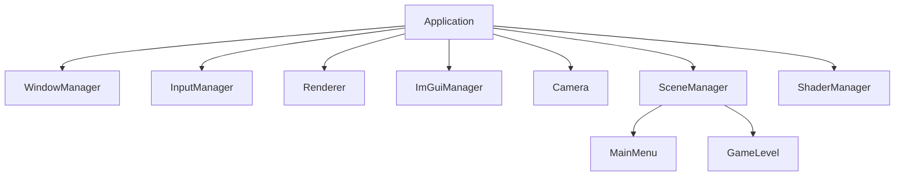
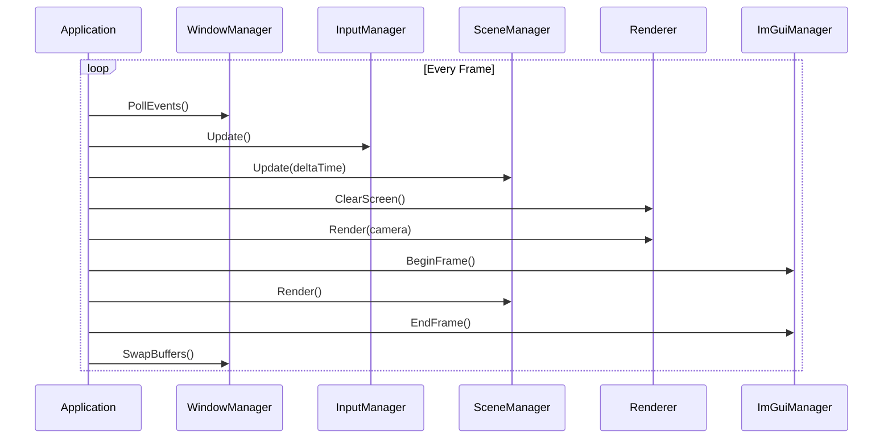
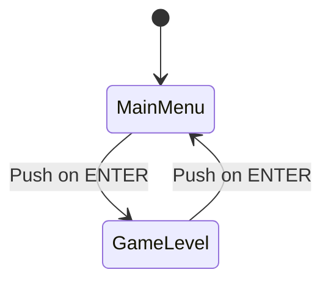

---

### 2. Main Loop Flow


---

### 3. Scene Management


---

### 4. Key Data Flow
```mermaid
flowchart LR
    InputManager --> Camera:eyboard/Mouse
    Camera --> Renderer: View/Projection Matrices
    ShaderManager --> Renderer: Shader Programs
    SceneManager --> ImGuiManager: UI Rendering
```

---

### 5. Dependency Graph (via CMake + Graphviz)
```bash
# Generate with:
cmake --graphviz=deps.dot .
dot -Tpng deps.dot -o dependencies.png
```

---

### 6. Critical Code Snippets

#### Context Sharing
```cpp
// Application.cpp
Context ctx{
    .window = m_windowManager.get(),
    .input = m_inputManager.get(),
    .renderer = m_renderer.get(),
    .scenes = m_sceneManager.get(),
    .camera = m_camera.get(),
    .imgui = m_imguiManager.get(),
    .shaders = m_shaderManager.get()
};
```

---

### 7. Architecture Summary Table

| Component          | Responsibility                          | Depends On               |
|--------------------|-----------------------------------------|--------------------------|
| WindowManager      | GLFW window/context management          | GLFW, OpenGL             |
| InputManager       | Input state aggregation                 | GLFW callbacks           |
| Renderer           | OpenGL draw command management          | ShaderManager, Camera    |
| SceneManager       | State transitions & scene lifecycle     | Context                  |
| ImGuiManager       | UI rendering pipeline                   | GLFW/OpenGL backends     |
| ShaderManager      | Shader program lifecycle                | OpenGL                   |
| Camera             | View/projection matrices                | InputManager             |