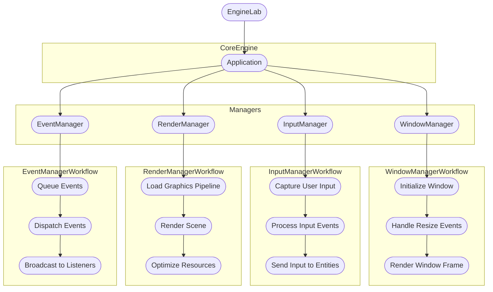

```mermaid
flowchart TD
    usm([EngineLab]):::main

    subgraph CoreEngine
        asm([Application]):::subsystem
    end

    subgraph Managers
        s_a(["WindowManager"]):::component
        s_b(["InputManager"]):::component
        s_c(["RenderManager"]):::component
        s_d(["EventManager"]):::component
    end

    %% Main Relationships
    usm --> asm
    asm --> s_a
    asm --> s_b
    asm --> s_c
    asm --> s_d

    %% WindowManager Workflow
    subgraph WindowManagerWorkflow
        wa1([Initialize Window])
        wa2([Handle Resize Events])
        wa3([Render Window Frame])
        s_a --> wa1 --> wa2 --> wa3
    end

    %% InputManager Workflow
    subgraph InputManagerWorkflow
        ib1([Capture User Input])
        ib2([Process Input Events])
        ib3([Send Input to Entities])
        s_b --> ib1 --> ib2 --> ib3
    end

    %% RenderManager Workflow
    subgraph RenderManagerWorkflow
        rc1([Load Graphics Pipeline])
        rc2([Render Scene])
        rc3([Optimize Resources])
        s_c --> rc1 --> rc2 --> rc3
    end

    %% EventManager Workflow
    subgraph EventManagerWorkflow
        ev1([Queue Events])
        ev2([Dispatch Events])
        ev3([Broadcast to Listeners])
        s_d --> ev1 --> ev2 --> ev3
    end
```