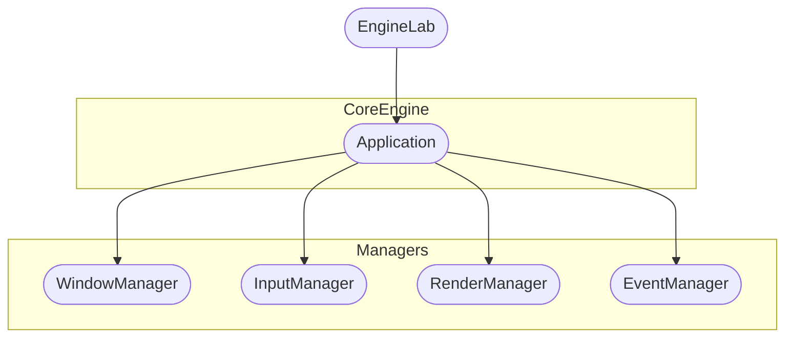

```mermaid
flowchart TD
    usm([EngineLab]):::main

    subgraph CoreEngine
        asm([Application]):::subsystem
    end

    subgraph Managers
        s_a(["WindowManager"]):::component
        s_b(["InputManager"]):::component
        s_c(["RenderManager"]):::component
        s_d(["EventManager"]):::component
    end

    usm --> asm
    asm --> s_a
    asm --> s_b
    asm --> s_c
    asm --> s_d
```